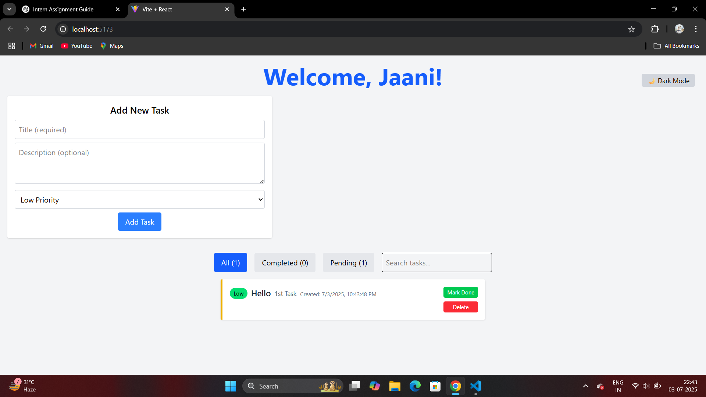
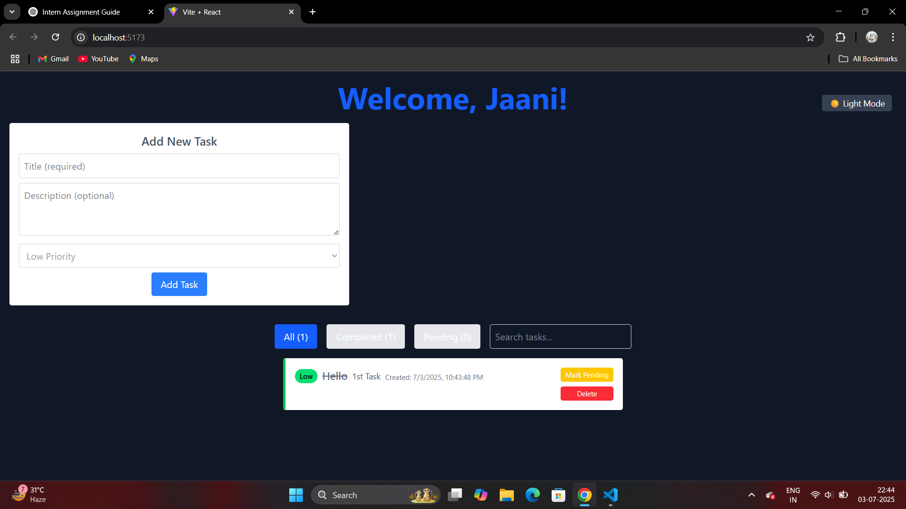

# 📝 Personal Task Tracker

A fully responsive task tracking application built with **React**, **Vite**, and **TailwindCSS** as part of a pre-hire intern assignment. It includes core features like task creation, filtering, search, priority levels, and dark mode.

---

## 🚀 Features

- ✅ Login with localStorage (no auth)
- ✅ Add/Edit/Delete Tasks
- ✅ Mark as Completed / Pending
- ✅ Filter Tasks: All / Completed / Pending
- ✅ Search Tasks by Title/Description
- ✅ Priority Levels: Low / Medium / High
- ✅ Dark/Light Mode Toggle
- ✅ Fully responsive (mobile & desktop)
- ✅ LocalStorage persistence

---

## 🎨 Technologies Used

- [Vite + React](https://vitejs.dev/)
- [Tailwind CSS](https://tailwindcss.com/)
- React Hooks (`useState`, `useEffect`)

---

## 🛠 Setup Instructions

1. Clone the repo:

```
git clone https://github.com/your-username/task-tracker.git
cd task-tracker
```

2. Install dependencies:

```
npm install
```

3. Start development server:

```
npm run dev
```

4. Open in browser:
[http://localhost:5173](http://localhost:5173)

---

## 🌐 Live Demo
[🔗 Live Application](https://task-tracker-sepia-sigma.vercel.app/)

---

## 🖼 Screenshots

| Light Mode                        | Dark Mode                       |
| --------------------------------- | ------------------------------- |
|  |  |

---

## 📦 Folder Structure

src/
├── components/
│   ├── Login.jsx
│   ├── TaskForm.jsx
│   ├── TaskItem.jsx
│   ├── TaskList.jsx
│   ├── TaskFilter.jsx
├── hooks/
│   └── useDarkMode.js
├── styles/
│   └── index.css
├── App.jsx
├── main.jsx

---

## ✍️ Notes

* Developed following all assignment requirements
* Clean, modular code using React functional components
* Bonus features added for enhanced UX

## 👨‍💻 Author

Jitin Sharma
Full-Stack Developer | React Enthusiast
📧 Email: [theshayarguyjaani@gmail.com](mailto:theshayarguyjaani@gmail.com)
🔗 LinkedIn: [Jitin Sharma](https://www.linkedin.com/in/jitin-sharma-5191ba2aa)
